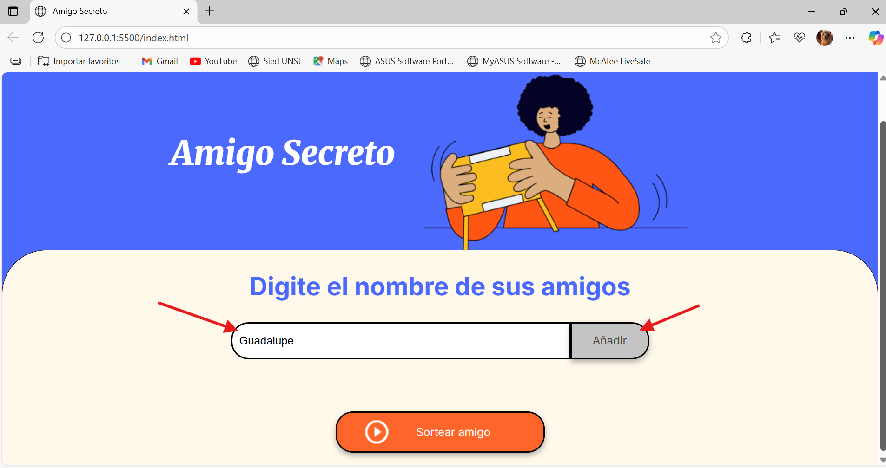
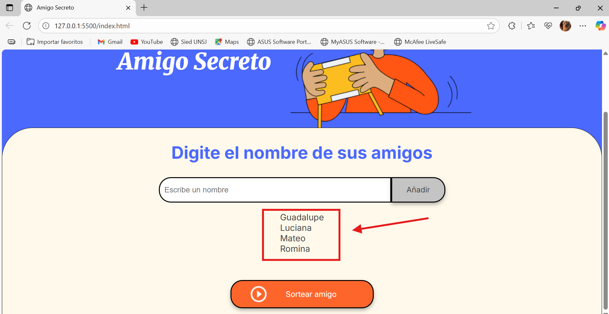
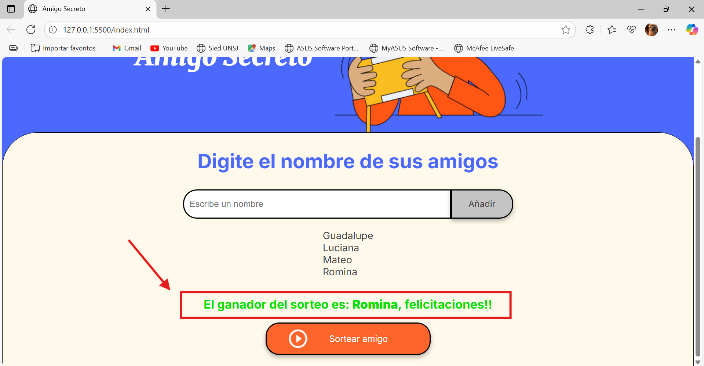

<h1 align="center"> Amigo Secreto </h1>
<p align="center">
  
</p>

<!-- Badges -->
<p align="center">
  
  
</p>

## Índice
- [Descripción del Proyecto](#descripción-del-proyecto)
- [Estado del Proyecto](#estado-del-proyecto)
- [Funcionalidades](#funcionalidades)
- [Demo / Capturas](#demo--capturas)
- [Repositorio](#repositorio)
- [Como usar](#Como-usar)
- [Tecnologías](#tecnologías)
- [Contribuidores](#contribuidores)
- [Licencia](#licencia)

---

## Descripción del Proyecto
Este proyecto es una app web sencilla (HTML, CSS y JavaScript) para organizar un sorteo de **Amigo Secreto** de forma interactiva. Permite ingresar nombres, validar entradas, y asignar amigos secretos al azar sin repeticiones ni autoasignaciones.

---

## Estado del Proyecto
<h4 align="center"> En desarrollo </h4>
El proyecto ya funciona en su versión básica. Planeo agregar almacenamiento local, exportación de resultados y más estilo visual en cuanto avance con mi aprendizaje.

---

## Funcionalidades
- Alerta si el usuario intenta agregar nombres vacíos o duplicados  
- Visualización de la lista de participantes  
- Sorteo aleatorio garantizando que nadie se autoasigne  
- Mensajes al estilo “X tiene a Y como amigo secreto”

---

## Demo / Capturas de Pantalla
### Formulario para agregar participantes  


### Lista antes del sorteo  


### Resultado del sorteo  


---

##  Repositorio
1. Clona o descarga el repositorio con el siguiente comando:  
   ```bash
   git clone https://github.com/GuadaS03/amigo-secreto.git

## Como usar
  1.Abre el proyecto clonado en tu navegador o servidor local.
  2.En el apartado "Escribe un nombre", escribe el nombre de un participante.
  3.Haz clic en el botón "Añadir" para agregarlo a la lista.
  4.Repite los pasos 2 y 3 hasta haber agregado todos los participantes.
  5.Cuando la lista esté completa, haz clic en el botón "Sortear amigo".
  6.El resultado mostrará el nombre del ganador del sorteo.

